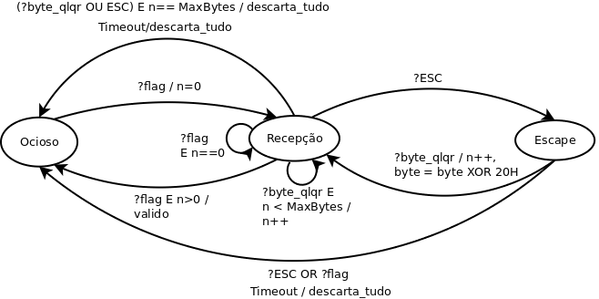

# Projeto 1 

## Modelagem do enquadramento

- Técnica de enquadramento: **sentinela**.
- Flag delimitadora de quadro: `7E (01111110)`
- Byte de escape: `7D (01111101)`
- Regra de modificação após byte de escape: `XOR 20`

### MEF do enquadramento
